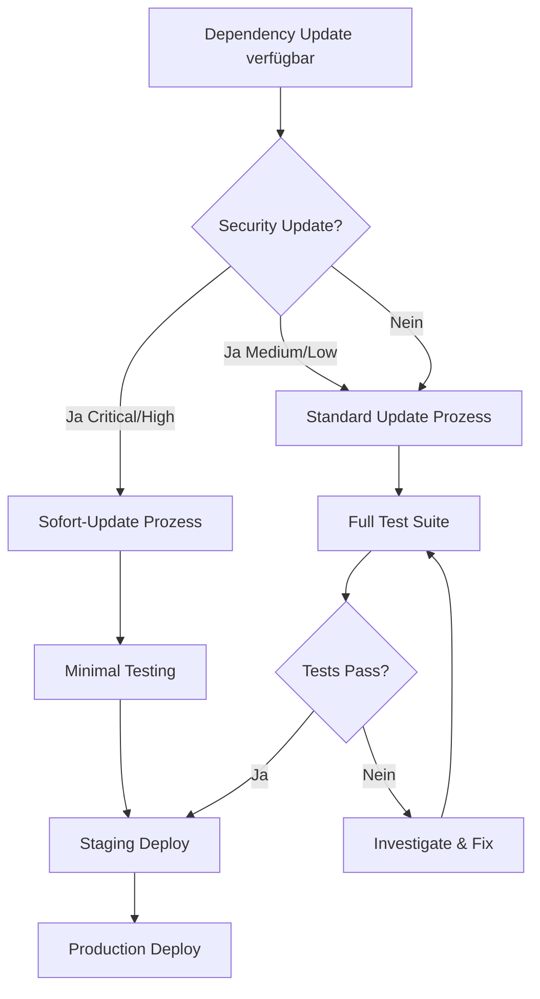

# Dependency Update Policy

Diese Standards definieren einheitliche Policies für das Updaten von Dependencies über alle Projekte hinweg.

## 1. Grundprinzipien

### Kernregeln

1. **Alle Versionen müssen gepinned sein** - Keine `^`, `~`, `*` oder `:latest`
2. **Updates sind bewusste Entscheidungen** - Nicht automatisch mergen
3. **Security Updates haben Priorität** - Innerhalb von 24-48 Stunden
4. **Test vor Update** - Keine Updates ohne Test-Coverage

### Version Pinning Examples

```json
// package.json - RICHTIG ✓
{
  "dependencies": {
    "next": "14.2.3",
    "react": "18.3.1",
    "@prisma/client": "5.11.0"
  }
}

// package.json - FALSCH ✗
{
  "dependencies": {
    "next": "^14.0.0",
    "react": "~18.3.0",
    "@prisma/client": "*"
  }
}
```

```dockerfile
# Dockerfile - RICHTIG ✓
FROM node:22.13.1-alpine
FROM postgres:17.2

# Dockerfile - FALSCH ✗
FROM node:latest
FROM node:22
FROM postgres:17
```

```txt
# requirements.txt - RICHTIG ✓
fastapi==0.109.2
pydantic==2.6.1
sqlalchemy==2.0.25

# requirements.txt - FALSCH ✗
fastapi>=0.100.0
pydantic
sqlalchemy~=2.0
```

## 2. Update-Kategorien

### Semantic Versioning (SemVer)

```
MAJOR.MINOR.PATCH
  │     │     └── Bug fixes, no API changes
  │     └──────── New features, backwards compatible
  └────────────── Breaking changes
```

### Update-Prioritäten

| Kategorie | Priorität | Zeitrahmen | Review |
|-----------|-----------|------------|--------|
| Security Critical | P0 | < 24h | Minimal |
| Security High | P1 | < 48h | Standard |
| Security Medium | P2 | < 1 Woche | Standard |
| Security Low | P3 | Nächster Zyklus | Standard |
| Major Version | Standard | Geplant | Ausführlich |
| Minor Version | Standard | 2 Wochen | Standard |
| Patch Version | Standard | 2 Wochen | Minimal |

## 3. Security Updates

### Erkennung

```bash
# JavaScript/TypeScript
npm audit
npm audit --audit-level=high

# Python
pip-audit
safety check -r requirements.txt

# All (mit Snyk)
snyk test
```

### npm audit Response Matrix

| Severity | Action |
|----------|--------|
| Critical | Sofort updaten, Deploy innerhalb 24h |
| High | Update innerhalb 48h |
| Moderate | Update im nächsten Sprint |
| Low | Backlog, nächster Update-Zyklus |

### Automatische Security Updates

```yaml
# .github/dependabot.yml
version: 2
updates:
  - package-ecosystem: "npm"
    directory: "/"
    schedule:
      interval: "daily"
    open-pull-requests-limit: 10
    # Nur Security Updates automatisch
    groups:
      security-updates:
        applies-to: security-updates
```

## 4. Update-Prozess

### Regulärer Update-Zyklus (2 Wochen)

```
Woche 1: Sammeln
├── Dependabot PRs reviewen
├── Security Advisories prüfen
└── Update-Kandidaten identifizieren

Woche 2: Implementieren
├── Updates in Dev-Branch mergen
├── Tests ausführen
├── Staging-Deploy & Testing
└── Production-Deploy
```

### Update Workflow



### Checkliste pro Update

- [ ] Changelog gelesen
- [ ] Breaking Changes identifiziert
- [ ] Security Advisories geprüft
- [ ] Lokale Tests bestanden
- [ ] CI/CD Pipeline grün
- [ ] Staging getestet
- [ ] PR approved
- [ ] Deployed to Production
- [ ] Monitoring überprüft

## 5. Major Version Updates

### Planung erforderlich

Major Updates erfordern:

1. **Impact Analysis**
   - Welche Code-Änderungen sind nötig?
   - Welche Dependencies sind betroffen?
   - Geschätzter Aufwand?

2. **Staging-Test**
   - Vollständiger Test in Staging-Umgebung
   - Performance-Vergleich
   - Regression Testing

3. **Rollback-Plan**
   - Kann schnell zurückgerollt werden?
   - Sind Database-Migrations betroffen?

### Beispiel: Next.js 14 → 15

```markdown
# Major Update Plan: Next.js 15

## Impact Analysis
- [ ] App Router Changes prüfen
- [ ] Deprecated APIs identifizieren
- [ ] Third-party Library Kompatibilität

## Code Changes Required
- [ ] Update next.config.js
- [ ] Server Components anpassen
- [ ] Middleware aktualisieren

## Testing
- [ ] Unit Tests
- [ ] Integration Tests
- [ ] E2E Tests
- [ ] Performance Benchmark

## Rollback
- Git revert möglich: Ja
- Database changes: Keine
- Rollback-Zeit: < 10 Minuten
```

## 6. Automatisierung

### Dependabot Konfiguration

```yaml
# .github/dependabot.yml
version: 2
updates:
  # NPM
  - package-ecosystem: "npm"
    directory: "/"
    schedule:
      interval: "weekly"
      day: "monday"
      time: "09:00"
      timezone: "Europe/Berlin"
    open-pull-requests-limit: 10
    labels:
      - "dependencies"
      - "npm"
    groups:
      # Group patch updates together
      patch-updates:
        applies-to: version-updates
        update-types:
          - "patch"
      # Group dev dependencies
      dev-dependencies:
        applies-to: version-updates
        dependency-type: "development"
        update-types:
          - "minor"
          - "patch"
    ignore:
      # Ignore major updates (handle manually)
      - dependency-name: "*"
        update-types: ["version-update:semver-major"]

  # Python
  - package-ecosystem: "pip"
    directory: "/"
    schedule:
      interval: "weekly"
      day: "monday"
    open-pull-requests-limit: 5
    labels:
      - "dependencies"
      - "python"

  # Docker
  - package-ecosystem: "docker"
    directory: "/"
    schedule:
      interval: "weekly"
    labels:
      - "dependencies"
      - "docker"

  # GitHub Actions
  - package-ecosystem: "github-actions"
    directory: "/"
    schedule:
      interval: "weekly"
    labels:
      - "dependencies"
      - "ci"
```

### Renovate Alternative

```json
// renovate.json
{
  "$schema": "https://docs.renovatebot.com/renovate-schema.json",
  "extends": [
    "config:base",
    ":pinAllExceptPeerDependencies",
    ":semanticCommits",
    "group:allNonMajor"
  ],
  "schedule": ["before 9am on monday"],
  "timezone": "Europe/Berlin",
  "labels": ["dependencies"],
  "packageRules": [
    {
      "matchUpdateTypes": ["major"],
      "labels": ["major-update"],
      "automerge": false
    },
    {
      "matchUpdateTypes": ["patch", "minor"],
      "matchPackagePatterns": ["*"],
      "groupName": "all non-major dependencies",
      "automerge": true,
      "automergeType": "pr"
    },
    {
      "matchDepTypes": ["devDependencies"],
      "automerge": true
    }
  ],
  "vulnerabilityAlerts": {
    "labels": ["security"],
    "automerge": true
  }
}
```

## 7. Lock Files

### Pflege von Lock Files

```bash
# NPM - package-lock.json
npm ci              # Install from lock file (CI/Production)
npm install         # Update lock file (Development)

# Python - Generiere requirements.txt aus pyproject.toml
pip-compile pyproject.toml -o requirements.txt

# Oder mit pip-tools
pip-sync requirements.txt
```

### Lock File Best Practices

- **Immer committen**: `package-lock.json`, `requirements.txt`
- **CI verwendet Lock File**: `npm ci` statt `npm install`
- **Regelmäßig regenerieren**: Bei Dependency-Änderungen

### WICHTIG: Node Version Kompatibilitaet

`package-lock.json` ist an die npm-Version gebunden. Lockfiles die mit einer neueren
npm-Version erzeugt wurden, sind NICHT kompatibel mit aelteren Versionen.

**Problem**: Lokale Entwicklung mit Node 24 (npm 11), CI mit Node 22 (npm 10) → `npm ci` schlaegt fehl.

**Loesung**: Lockfile immer mit derselben Node-Version wie CI regenerieren:

```bash
# Lockfile fuer Node 22 CI erzeugen (auch wenn lokal Node 24 laeuft)
docker run --rm -v $(pwd)/frontend:/app -w /app node:22-alpine npm install
```

Alternativ: `.nvmrc` oder `.node-version` im Projekt festlegen und in CI + lokal nutzen.

## 8. Dependency Audit Report

### Monatlicher Report Template

```markdown
# Dependency Audit Report - [Monat Jahr]

## Zusammenfassung
- Geprüfte Projekte: X
- Security Issues gefunden: X
- Updates durchgeführt: X

## Security Issues

### Kritisch/Hoch
| Package | Current | Fixed | CVE | Status |
|---------|---------|-------|-----|--------|
| lodash | 4.17.15 | 4.17.21 | CVE-2021-23337 | ✅ Fixed |

### Medium/Low
| Package | Current | Fixed | CVE | Status |
|---------|---------|-------|-----|--------|
| ... | ... | ... | ... | ... |

## Major Updates Pending
| Package | Current | Latest | Breaking Changes |
|---------|---------|--------|------------------|
| next | 14.2.3 | 15.0.0 | Server Components API |

## Empfehlungen
1. ...
2. ...
```

## 9. Tool-spezifische Commands

### NPM/Node.js

```bash
# Check for outdated packages
npm outdated

# Security audit
npm audit
npm audit fix              # Auto-fix (use with caution)
npm audit fix --force      # Force fix (DANGER - may break)

# Update specific package
npm install package@version

# Update all (to latest within semver range)
npm update

# Interactive update tool
npx npm-check-updates -i
```

### Python

```bash
# Check for outdated packages
pip list --outdated

# Security audit
pip-audit
safety check -r requirements.txt

# Update specific package
pip install package==version

# Generate updated requirements
pip-compile --upgrade pyproject.toml
```

### Docker

```bash
# Check for base image updates
docker pull node:22-alpine
docker images --digests

# Use specific digest for reproducibility
FROM node:22-alpine@sha256:abc123...
```

## 10. Entscheidungsmatrix

### Wann Update durchführen?

| Situation | Aktion |
|-----------|--------|
| Security Critical | Sofort, auch außerhalb Zyklus |
| Security High | Innerhalb 48h |
| Bug fix (Patch) | Nächster Update-Zyklus |
| New Feature (Minor) | Wenn Feature benötigt |
| Breaking Change (Major) | Geplantes Update-Projekt |
| Deprecated Package | Planen, nicht ignorieren |

### Wann NICHT updaten?

- Kurz vor einem Release
- Ohne ausreichende Test-Coverage
- Wenn Breaking Changes nicht verstanden sind
- Wenn kein Rollback-Plan existiert

## 11. Documentation

### Changelog Tracking

```markdown
# CHANGELOG.md

## [1.2.0] - 2025-01-15

### Dependencies Updated
- next: 14.2.2 → 14.2.3 (security fix)
- @prisma/client: 5.10.0 → 5.11.0 (new features)
- eslint: 8.56.0 → 8.57.0 (bug fixes)

### Security Fixes
- CVE-2025-1234: Fixed by updating xyz package
```

---

**Letzte Aktualisierung**: 2025-12
**Owner**: Development Team
**Review Zyklus**: Monatlich
